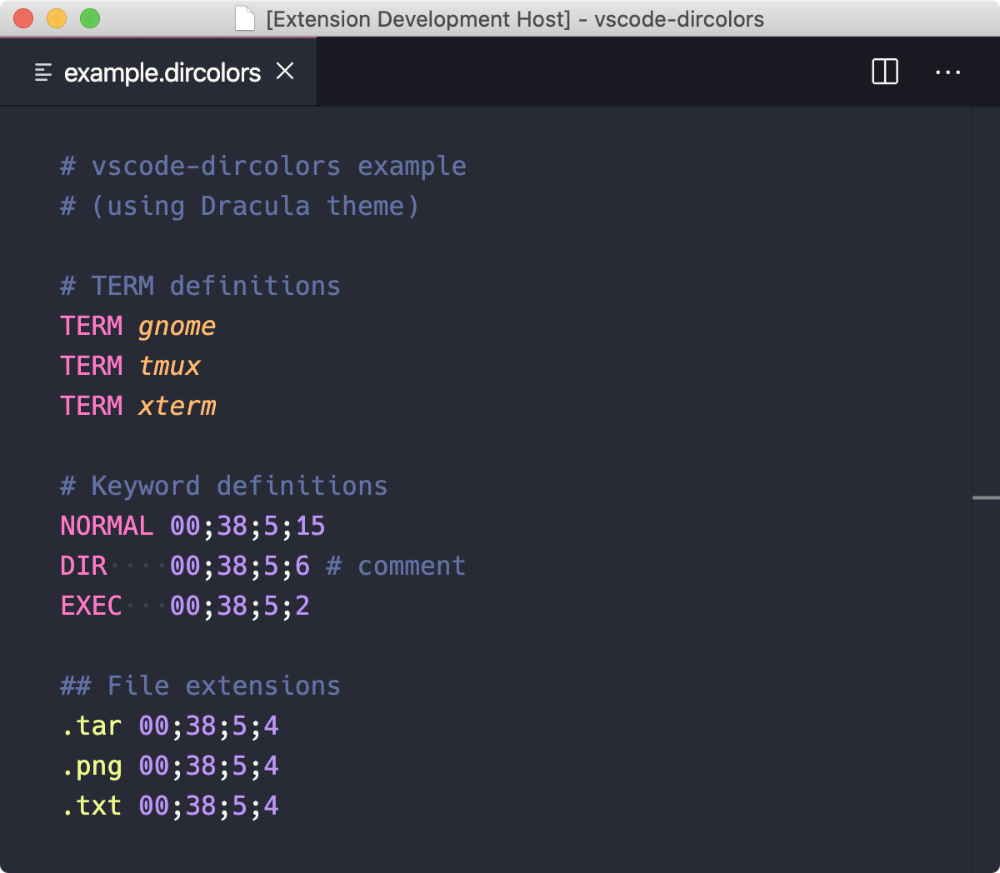

  

# vscode-dircolors

📁🌈 VS Code syntax highlighting and snippets for `.dircolors` files.

## Syntax highlighting

- Highlights comments, keywords, file extensions and values.
- Enables auto-commenting.

## Snippets

This extension adds several nifty snippets that can help with remembering color/attribute codes and
keywords. As with any snippet, simply write the prefix and press tab to convert it to the value.

- Colors can be prefixed with `b` to make it a background color instead.
- `$1` indicates where the cursor ends up after pressing tab.

#### Prefix/result table

| Color    |       | Attribute  |       | Keyword |                 |
| -------- | ----- | ---------- | ----- | ------- | --------------- |
| black    | `30;` | none       | `00;` | T       | `TERM $1\n`     |
| bblack   | `40;` | bold       | `01;` | C       | `COLOR $1\n`    |
| red      | `31;` | \_         | `04;` | E       | `EIGHTBIT $1\n` |
| bred     | `41;` | underscore | `04;` | O       | `OPTION $1\n`   |
| green    | `32;` | blink      | `05;` | N       | `NORMAL 00\n`   |
| bgreen   | `42;` | reverse    | `07;` | F       | `FILE $1\n`     |
| yellow   | `33;` | concealed  | `08;` | D       | `DIR $1\n`      |
| byellow  | `43;` |            |       | L       | `LINK $1\n`     |
| blue     | `34;` |            |       | M       | `MISSING $1\n`  |
| bblue    | `44;` |            |       | S       | `SOCK $1\n`     |
| magenta  | `35;` |            |       | B       | `BLK $1\n`      |
| bmagenta | `45;` |            |       | X       | `EXEC $1\n`     |
| cyan     | `36;` |            |       |         |                 |
| bcyan    | `46;` |            |       |         |                 |
| white    | `37;` |            |       |         |                 |
| bwhite   | `47;` |            |       |         |                 |

## Credits

Grammar files and snippets were adapted from
[language-dircolors](https://github.com/jolkdarr/language-dircolors) by
[jolkdarr](https://github.com/jolkdarr), a similar extension for Sublime Text.
